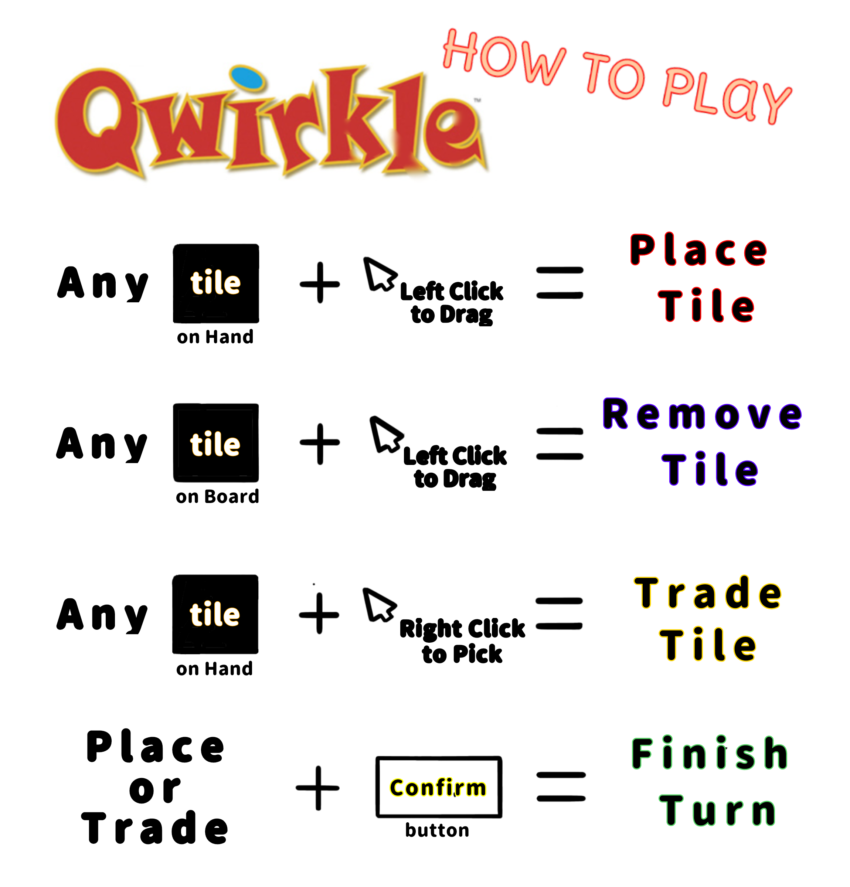

# 🔶 Qwirkle 🔷

This is a multiplayer implementation of the tile-based board game Qwirkle. Written entirely in Python, this game uses client-server architecture, and therefore requires connecting to a Qwirkle [server](https://github.com/COMP-4721-Group-5/Backend). Note that the default port for these servers is 1234.

For more information about setting up and connecting to the server, see the linked backend repository.

To run the game, you should first navigate to the cloned repository and run the command ```pip install -r requirements.txt```. Then, simply run ```python view.py```

## Demonstration

### Playing a turn


### Discarding tiles


### Controls


